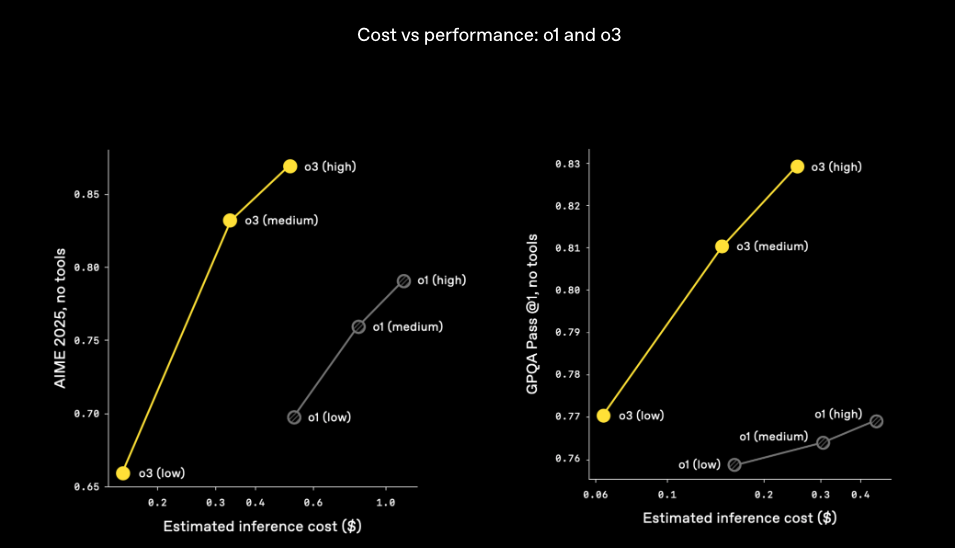

!!! quote "BY THE END OF THIS SECTION YOU SHOULD KNOW"

    1. What reasoning models are and the scenarios they are best suited for
    1. The reasoning models available in Azure AI Foundry model catalog
    1. The reasoning models available in GitHub Models Marketplace

!!! info "**IN-VENUE ATTENDEES:** This content will be covered by the instructor talk. Skip directly to Lab 3"

---

Reasoning models are a new category of Large Language Models that are trained (with large-scale reinforcement learning) to **think deeply before they respond**. These reasoning abilities are achieved by a combination of techniques including **chain-of-thought**, **self-consistency**, and **deliberative alignment**. 

Chain-of-thought prompting encourages the model to break down complex problems into smaller, manageable steps, while self-consistency allows the model to evaluate multiple solutions and select the most accurate one. [Deliberative alignment](https://arxiv.org/abs/2412.16339) helps models to reason about their own behaviors, helping to improve the safety and reliability of their responses.

!!! quote "In this workshop, we'll primarily use the Azure OpenAI  _o-series_ of models for hands-on labs. However, the concepts translate broadly to reasoning models from other providers including DeepSeek and Microsoft"

---

## What can they do?

Reasoning models are designed to tackle hard problems involving logic, stratgegy, complex reasoning and multi-step planning. They are particularly effective in STEM fields (math, science, coding) where they can outperform popular general-purpose models in competitive benchmarks.

As shown [in these charts](https://openai.com/index/introducing-o3-and-o4-mini/), **o3 and o4-mini** (the latest reasoning models from OpenAI) are capable of achieving state-of-the-art performance on a variety of reasoning tasks. 

1. **The PhD Model** - reached 83.3% accuracy on PhD-level science questions (GPQA Diamond)
1. **The Mathlete** - reached 92.7% accruracy on competitive Olympiad-level Math (AIME 2025)
1. **The Coder** - reached 69% accuracy in SWE benchmark, earned $65K in freelance benchmark
1. **The Multimodal Reasoner** - reached 86.8% accuracy on visual math reasoning problems

The ability to bring _multimodal reasoning_ to AI applications can be a game-changer for many industries - expanding the scope to new domains like healthcare, finance, and education. 

---

## Why is this important?

The stats above are impressive, but they don't tell the whole story. Reasoning models are not just about achieving high accuracy on benchmarks. They also offer significant advantages in terms of cost and speed. For instance, [data shows](https://openai.com/index/introducing-o3-and-o4-mini/) that the o3 and o4-mini models are significantly faster and cheaper than the `o1` series that came before. If the trend continues, they will become more competitive with general-purpose models and gain more adoption in production apps. 

So, how can you get hands-on experience with these models? Let's talk about two options.

---

## Azure AI Foundry models

The [Azure AI Foundry model catalog](https://ai.azure.com/explore/models) has a rich set of options that you can explore for use in production. Here are a few of the popular options:

1. [MAI-DS-R1](https://ai.azure.com/explore/models/MAI-DS-R1/version/1/registry/azureml?) - a DeepSeek-R1 reasoning model post-trained by the Microsoft AI team 
1. [o4-mini](https://ai.azure.com/explore/models/o4-mini/version/2025-04-16/registry/azure-openai?)- the most efficient reasoning model in the o-series, good for agentic use
1. [o3](https://ai.azure.com/explore/models/o3/version/2025-04-16/registry/azure-openai?) - the most capable reasoning model in the o-series, first to support tool use
1. [o3-mini](https://ai.azure.com/explore/models/o3/version/2025-04-16/registry/azure-openai?) - the faster and more cost-efficient version of o3
1. [DeepSeek R1](https://ai.azure.com/explore/models/DeepSeek-R1/version/1/registry/azureml-deepseek?) - combined reinforcement learning with fine-tuning on curated datasets
1. [o1-mini](https://ai.azure.com/explore/models/o1-mini/version/2024-09-12/registry/azure-openai?) - the faster and more cost-efficient version of o1
1. [o1](https://ai.azure.com/explore/models/o1/version/2024-12-17/registry/azure-openai?) - the first  reasoning model from OpenAI, launching the o-series

!!! info "For our hands-on labs, we'll prioritize o4-mini but compare with o1 or gpt-4o-mini as needed"

---

## GitHub Marketplace models

But what if you just want to get a sense for the models and don't yet have an Azure subscription? The [**GitHub Models Marketplace**](https://github.com/marketplace?category=reasoning&type=models) collection may be your best starting point. These are Azure AI Foundry models that you can access for free with just a GitHub account! They support a serverless endpoint that can be accessed from the browser (playground) or from code (API), making it easy to go from ideation to implementation while you learn. 

Keep in mind:

1. _GitHub Models are rate-limited._ Use the models for learning, not for production.
1. _Migrating to Azure later is easy._ Just use [the Azure AI model inference](https://learn.microsoft.com/en-us/azure/ai-foundry/model-inference/how-to/quickstart-github-models?tabs=python) service.
