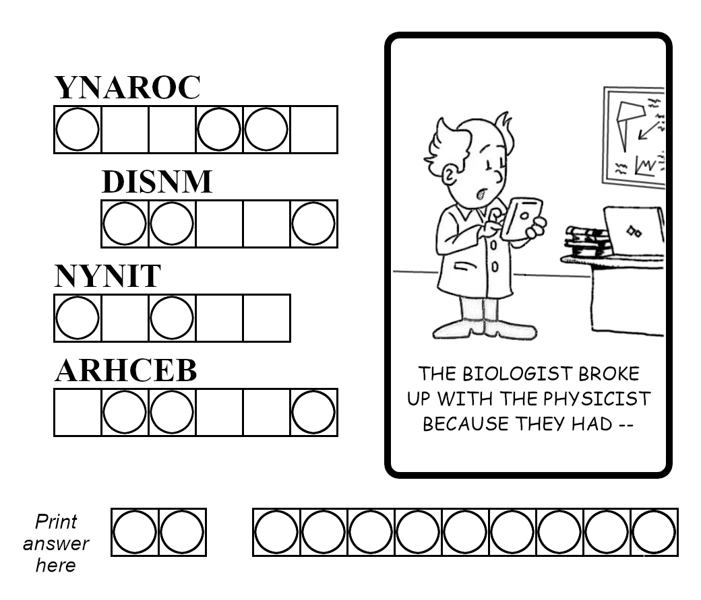
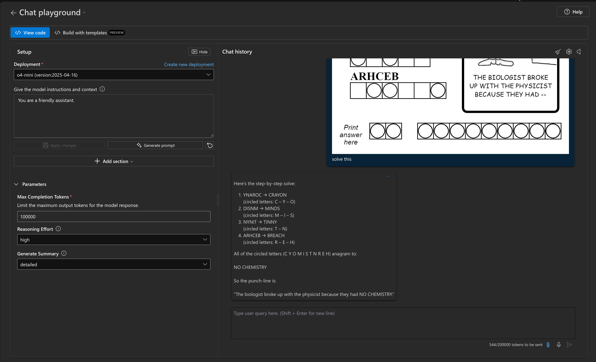

# Visual Reasoning

Visual Reasoning is when the model is not just analyzing the picture (object recognition), it is actively using it for reasoning. This is a fascinating new area for reasoning applications - so let's use this lab to explore a small example.

---

## 1. Prompt

Here is a good example of a visual reasoning challenge - a **word jumble**. The image come from  [this Wikipedia article](https://en.wikipedia.org/wiki/Jumble).

1. Upload the image to the Playground.
1. Use the prompt "Solve this"


    
---

## 2. First Response
How did it do?

1. It got the answer right: **No Chemistry** 
1. Note that the model was configured for **detailed** response and showed its work
1. The response took 544 tokens with _high_ reasoning effort.
1. It also recognized that the puzzle was humorous (cites the "punchline")


    

## 3. Don't Generate Summary

Repeat (2) but set _generate summary_ option to "none"?

1. The response took 345 tokens with _high_ reasoning effort.
1. The output was shorter and less detailed than the previous one

```
First you unscramble each word:

YNAROC → CRAYON
DISNM → MINDS
NYNIT → TINNY
ARHCEB → BREACH

Then you take the letters in the circled positions of each (3 from CRAYON, 3 from MINDS, 2 from TINNY, 3 from BREACH) to get

C Y O  M I S  T N  R E H

Finally you anagram those eleven letters into the punny answer:

NO CHEMISTRY
```

---

## 4. Low Reasoning Effort

Now also set _reasoning effort_ option to "low"?

1.The answer was still correct - but took more (389) tokens

## 5. Continued Conversation

Let's ask the model to see if it can create a new puzzle like that one. Does it understand the pattern?

> "create a new puzzle like that one - and explain how you did it"

1. Note that the model was reset to high reasoning effort and detailed response
1. The response took  953 tokens with _high_ reasoning effort.
1. It not only created the puzzle and explained the reasoning, it understood the pattern and made sure there was a punny answer.

```

??? success "Click to expand for response"

      Here’s a “break‑up pun” puzzle along the same lines:

      PUZZLE
      Unscramble each row into an ordinary word. In the finished word, the letters in circled boxes are to be collected (in any order) to spell the two‑word punch‑line.

      O M L A R
      □◯□◯◯
      (unscrambles to ______ )

      P A R E S
      ◯□◯□□
      (unscrambles to ______ )

      A T P I N
      ◯◯□□□
      (unscrambles to ______ )

      C E O N
      □□◯◯
      (unscrambles to ______ )

      CARTOON CAPTION
      “The geologist broke up with the astronomer because they needed ______________.”

      Print the 9 circled letters here:
      □□ □□□□□
      
      SOLUTION SKETCH

      OMLAR → MORAL
      circled letters (positions 1, 2, 3) → M O R
      PARES → SPEAR
      circled letters (positions 1, 3) → S E
      ATPIN → PAINT
      circled letters (positions 1, 2) → P A
      CEON → ONCE
      circled letters (positions 3, 4) → C E
      Collected letters are M O R E S P A C E → “MORE SPACE.”

      So the finished caption reads:
      “The geologist broke up with the astronomer because they needed MORE SPACE.”

      
      HOW I MADE IT

      Pick a short punny phrase (“MORE SPACE”) for the cartoon punch‑line.
      List its letters (M,O,R,E,S,P,A,C,E) and decide how many circles to draw on each of four words (here 3+2+2+2 = 9).
      Choose four everyday words that contain exactly the needed circled letters.
      Scramble each word and mark which positions will be circled.
      Lay out the puzzle with blanks, circles, and the cartoon clue so that solvers unscramble, extract the circled letters, then re‑scramble them into the final joke answer.


---

## 6. Make it Markdowm

Add the `formatting re-enabled` tag to the system context - and let's give it a new prompt challenge.

"create another puzzle but this time pick the 4 words so they are examples of a specific type of thing - where the fifth solution word tells you what that type of thing is"

!!! warning "We confused it a bit. It didn't  keep the same format."

      Here’s a quick one:

      Four words:
      • HAMMER
      • SCREWDRIVER
      • WRENCH
      • PLIERS

      What single word describes this set?

      Answer (the 5th solution word): TOOLS

---

## 7. Switch Task

Let's keep the conversation history but use a different image type and task. In this case, let's use a `webp` image of [a lava cake](https://publicdomainrecipes.com/lavacake/) that is in the public domain, and ask the model to estimate the calories in it. 


1. Upload this `webp` image to the Playground
1. Ask "Can you estimate the calories in this?"


!!! quote "Response"
    
    The model was able to recognize the image and estimate the calories in it. It also provided a detailed breakdown of the ingredients and their respective calorie counts.
    **Token Cost**: 572
    
    ```
      Here’s a rough breakdown based on typical portion sizes:

         • Chocolate “lava” cake (single serving, about 100–120 g): 350–450 kcal
         • Vanilla ice cream (one generous scoop, ~½ cup): 130–180 kcal
         • Berry sauce or coulis (2–3 Tbsp): 30–60 kcal
         • Fresh strawberry slices (3–4 medium berries): 10–15 kcal

         Total estimate: approximately 520–705 kcal

         Depending on exact serving sizes, you’re likely looking at somewhere in the 550–750 kcal range for the entire plate
    ```


## 8. Content Generation

This recipe is in the public domain - what happens if we turn on the safety messages and ask the model to create a recipe? Do we get safety warnings for copyrighted violations?

> Give me a recipe for this that matches the formats of online recipe websites. Provide ingredients prep-time cook-time and step by step instructions

??? info "Response: Full recipe (1108 tokens)"

      Molten Chocolate Lava Cakes with Berry Coulis and Fresh Strawberries

      Yields: 4 servings
      Prep Time: 20 minutes
      Cook Time: 12 minutes
      Total Time: 32 minutes

      INGREDIENTS
      For the Lava Cakes
      • 120 g (4 oz) dark chocolate (70% cocoa), chopped
      • 100 g (3½ oz) unsalted butter, plus extra for greasing
      • 2 large eggs
      • 2 large egg yolks
      • 50 g (¼ cup) caster (superfine) sugar
      • 25 g (3 tbsp) plain (all‑purpose) flour
      • Pinch of fine sea salt

      For the Berry Coulis
      • 150 g (5 oz) mixed berries (fresh or frozen; e.g. raspberries, blueberries, blackberries)
      • 2 tbsp granulated sugar
      • 1 tbsp fresh lemon juice
      • 1–2 tbsp water (as needed)

      To Serve
      • 4 scoops high‑quality vanilla ice cream
      • 4 large strawberries, hulled and sliced

      EQUIPMENT
      • 4 × 6 oz (180 ml) ramekins or custard cups
      • Baking tray
      • Small saucepan or double‑boiler setup
      • Whisk, spatula, sieve, and fine‑mesh strainer

      STEP‑BY‑STEP INSTRUCTIONS

      Preheat & prepare ramekins
      – Preheat the oven to 200 °C (400 °F).
      – Generously butter each ramekin, then dust with a little sugar, tapping out any excess. Set ramekins on a baking tray.

      Melt chocolate & butter
      – In a heatproof bowl set over (but not touching) simmering water, combine chopped dark chocolate and butter.
      – Stir occasionally until fully melted and smooth. Remove from heat and let cool for 2 minutes.

      Whisk eggs & sugar
      – In a separate bowl, whisk together whole eggs, yolks, sugar, and salt until pale, thick, and ribbon‑coating (about 2–3 minutes).

      Combine chocolate mixture
      – Gently fold the melted chocolate/butter into the egg mixture using a rubber spatula. Mix until just combined.

      Fold in flour
      – Sift the flour over the batter, then fold in lightly until no streaks of flour remain. Be careful not to overmix.

      Fill ramekins & bake
      – Divide batter evenly among the prepared ramekins.
      – Bake on the center rack for 10–12 minutes, until the edges are set but the centers still jiggle slightly when shaken.

      Rest briefly
      – Remove from oven and let rest for 1 minute. Run a small knife around the edge of each cake, then invert onto individual serving plates.

      Make the berry coulis
      – In a small saucepan, combine berries, sugar, and lemon juice. Cook over medium heat until the fruit breaks down and releases its juices (3–5 minutes).
      – Add water by the tablespoon if mixture seems too thick.
      – Strain through a fine‑mesh sieve into a bowl, pressing on solids to extract as much sauce as possible. Discard seeds.

      Plate & garnish
      – Using the back of a spoon, swoosh about 2–3 tbsp of coulis in a circle on each plate.
      – Place the warm lava cake in the center of the coulis swirl.
      – Top each cake with a scoop of vanilla ice cream.
      – Arrange sliced strawberries alongside or on top.

      Serve immediately
      – The contrast of warm, gooey chocolate and cold ice cream is best enjoyed right away.

      TIPS
      • To make ahead: Assemble batter in ramekins, cover tightly, and refrigerate up to 24 hours. Add 1–2 extra minutes to baking time if chilled.
      • For an extra flourish: Dust with icing sugar or sprinkle a few fresh mint leaves.